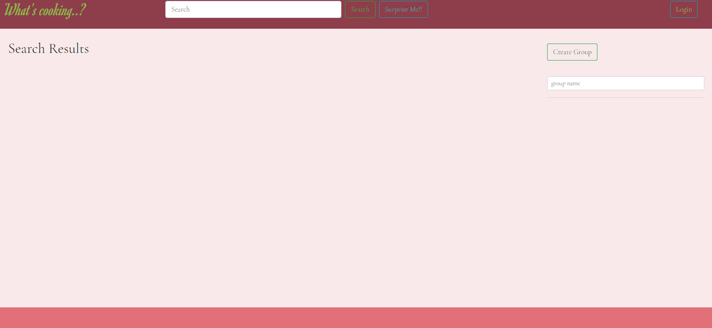
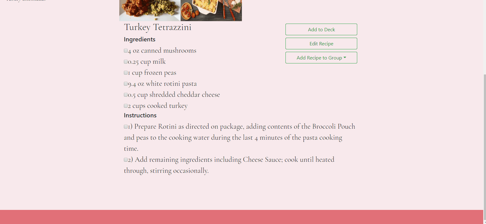
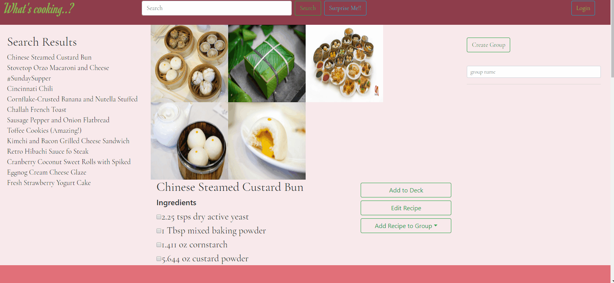

# What's Cooking App

Link to Project:
https://jsills3110.github.io/Project-1/

This is a Recipe App, that will allow for quick retrieval, editing and grouping of recipies. There are two api calls, one for the images, and another to retrieve the recipe. You can also save recipies and groups of recipies to your profile. Below are some of the tasks you can perform with the Recipe App. 

* Search Recipe
* Edit Recipe
* Suprise Me
* Add to Deck
* Add to Group
* Sign Up
* Log in

### Searching Recipie

Below is an example of using the app to search for a recipe:

<a name="EditRecipe">### Editing Recipie</a>
  
Below is an example of editing a recipe:

### Suprise Me

Suprise me is a random recipe topic lookup. Below is an example of it being used:

### Add to Deck

Add to Deck gives you the ability to save recipe to the bottom of your deck, to be able to be easily retrieved at a later point in time. Below is an example of this functionality:

### Add to Group

Add to group allows groupings of recipies. For example if you need to prepare a dinner, you can have multiple dishes, and retrieve all those dishes to your deck if needed:

### Sign Up

Sign up allows you to save recipe groups to be recalled at a later point in time from anywhere. Below is an example of how to sign up:

### Login

Logging in allows you to recall saved recipe groups and edited recipies.

## Usage

This project was completed using HTML, CSS, Javascript, JQuery, Bootstrap, and Firebase.

## Contributing
Pull requests are welcome. For major changes, please open an issue first to discuss what you would like to change.

Please make sure to update tests as appropriate.

